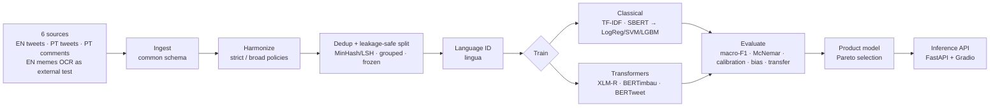

<div align="center">


# Bilingual Hate-Speech Detection (EN / PT)

**Binary hate-speech classification for English and Portuguese social-media text.
A reproducible study comparing classical models with transformers, plus a deployable inference API.**

[](https://github.com/isasaade-23/hate-speech-nlp-en-pt/actions/workflows/ci.yml)
[](https://isasaade-23.github.io/hate-speech-nlp-en-pt/)
[](https://luciola-hatecheck.streamlit.app/)


**[Try the live demo](https://luciola-hatecheck.streamlit.app/)** ·
**[Documentation](https://isasaade-23.github.io/hate-speech-nlp-en-pt/)** ·
**[Code](https://github.com/isasaade-23/hate-speech-nlp-en-pt)**

</div>

---

## Overview

This project trains and rigorously compares hate-speech classifiers for a **bilingual (EN + PT),
text-only** setting, with language detection at the input. It pursues a dual goal: a
**reproducible research artifact** (every table and figure is generated from code) and a
**deployable product** (a calibrated inference API with a documented model-selection decision).

The scientific core is a fair, leakage-safe comparison of two model families under one protocol:

- **Classical / tabular:** TF-IDF (word + character n-grams) and frozen multilingual
  sentence embeddings (SBERT) feeding Logistic Regression, Linear SVM, and LightGBM.
- **Transformers:** XLM-RoBERTa (bilingual), BERTimbau (PT), and BERTweet (EN), fine-tuned on Colab.

## Live demo

The interactive demo, **Luciola**, runs the lightweight CPU model in the browser, in English or
Portuguese, in a light or dark theme. It classifies text live and renders the stop-word ablation
as an interactive heatmap.
**[Open Luciola](https://luciola-hatecheck.streamlit.app/)**

There is also a **browser extension** that runs the linear member of the served ensemble
fully inside the browser, with no network access and no server:
**[luciola-extension](https://github.com/isasaade-23/luciola-extension)** (v0.2.0 serves the
corpus v5 linear member; parity with the Python model verified below 1e-8 on a golden set).

## Key results (Beta 2.0 phase 2, corpus v5)

Corpus v5 (2026-08-16) adds two commercially-licensed English sources: Vidgen et al. 2021
*Dynamically Generated* (41k synthetic adversarial entries, 54% hate, CC BY 4.0) and
HateXplain (20k Twitter+Gab posts, MIT). The corpus doubled to 113,826 rows strict and hate
prevalence rose from 8% to 28.8%. On the (much harder, 36% adversarial) v5 test the stacked
ensemble scores **ROC-AUC 0.8875, macro-F1 0.791, recall on hate 0.736** — recall on hate
jumped from 0.55 to 0.74, the most product-visible effect. Full v5 tables, the per-source
breakdown and the language-balance analysis are in [docs/results.md](docs/results.md).

**That average is carried by English.** Split by language on the same test
(`reports/tables/stack_slices_v5_strict.csv`), recall on hate is **0.776 in English
(n=11,513) and 0.316 in Portuguese (n=4,748)**. In Portuguese the model recovers under a
third of the hate it is shown. The cause is measured and it is not the method: of the eight
corpus sources, the three permissively licensed ones are all English, and the four
Portuguese ones are restrictive or of indeterminate licence. See
[the slice table](docs/results.md#slices-the-aggregate-hides-the-language-gap).

| Model (strict, test v5) | ROC-AUC | macro-F1 | Recall on hate |
|----------------|---------|----------|----------------|
| **Stacked ensemble (served)** | **0.8875** | **0.7906** | **0.7359** |
| tfidf_logreg | 0.884 | 0.788 | 0.707 |
| tfidf_lgbm | 0.870 | 0.773 | 0.715 |
| tfidf_svm | 0.855 | 0.768 | 0.679 |

Numbers below describe corpus v4 and are not comparable (the test split changed).

## Beta 2.0 (corpus v4)

Beta 2.0 follows the roadmap in Gandhi et al. (2024), *Hate speech detection: A comprehensive
review of recent works*, Expert Systems ([doi:10.1111/exsy.13562](https://doi.org/10.1111/exsy.13562)):
stacked ensembles and affective-lexicon features are the levers with documented gains, and
text-only models collapse on meme OCR.

- **The Beta 2.0 model was a calibrated stacked ensemble.** A meta logistic regression over the
  three TF-IDF models (LogReg, SVM, LightGBM), with the meta weights, decision threshold and
  Platt calibration all fit on validation only. Test (strict, v4): ROC-AUC 0.877, macro-F1 0.711,
  ECE 0.044, 15 MB, ~34 ms per text on CPU. The same architecture, retrained on corpus v5, is
  what the demo serves today. Adding the two SBERT members reaches AUC 0.886
  but requires a 470 MB encoder; documented as a trade-off.
- **Meme OCR was demoted to an external test set.** Its per-source ROC-AUC was 0.547 (random):
  the meme's hate lives in the image + text jointly, which the survey confirms for text-only
  models (0.48-0.53). The primary corpus (v4) is social-media text: 53,540 rows after
  deduplication, five sources, three of them Portuguese (per-source AUC: HateBR 0.91,
  ToLD-Br 0.91, EN tweets 0.83, Fortuna 0.75).
- **Growing the Portuguese side paid off twice.** HateBR (7k Instagram comments) and ToLD-Br
  (21k tweets) raised the PT share to ~55% of the corpus and made PT the model's strongest
  language.
- **Honest probabilities.** The served score is Platt-calibrated on validation: test ECE
  dropped from 0.16 (raw) to 0.03-0.04 at zero cost in macro-F1.
- **Leakage-safe by construction.** Exact + near-duplicate (MinHash/LSH) deduplication and a
  group-stratified, frozen split guarantee no paraphrase crosses train/test. A CI test enforces it.
- **Negative results, tested and reported.** Bayesian HPO over the TF-IDF family, per-language
  thresholds, stop-word removal and frozen 230M-encoder embeddings all measured at or below the
  baseline; each is documented in the decision log instead of silently dropped.

### Archived: v1 study results (original 4-dataset corpus)

The classical-vs-transformer comparison below was run on the original corpus (before HateBR,
ToLD-Br and the meme-OCR demotion). The transformers have not yet been re-run on corpus v4
(they need Colab GPU), so these numbers describe that earlier corpus, not the current one.

- **Transformers won, significantly**: XLM-R macro-F1 0.750 (strict), BERTweet 0.748 (broad),
  ~4 points over the best classical baseline (paired McNemar with Holm, p = 0.003 / p < 0.001).
- **Cross-lingual transfer is where embeddings earn their keep**: TF-IDF collapses EN→PT
  zero-shot (0.42) while multilingual SBERT transfers (0.63).
- **A data-integrity bug, found and fixed**: the Portuguese source was decoded as latin-1 when
  it is UTF-8; the byte-level audit and rebuild lifted EN→PT transfer by ~4 points.

<div align="center">


*v1 study figure: test macro-F1 by model and label policy on the original corpus. Transformers
(coral) topped both policies; the gap over the best classical baseline was statistically
significant.*

</div>

### Beta 2.0 comparison (corpus v4, test)

| Model (strict) | ROC-AUC | macro-F1 | Recall on hate |
|----------------|---------|----------|----------------|
| **Stacked ensemble (then served)** | **0.877** | **0.711** | 0.548 |
| tfidf_logreg | 0.873 | 0.702 | 0.481 |
| tfidf_lgbm | 0.860 | 0.707 | 0.497 |
| tfidf_svm | 0.855 | 0.695 | 0.521 |
| Stack + SBERT members (not served) | 0.886 | 0.715 | 0.511 |

### v1 study: final comparison (test macro-F1, original corpus)

| Policy | Best transformer | Best classical | Δ | Significance (McNemar + Holm) |
|--------|------------------|----------------|----|-------------------------------|
| strict | XLM-R · **0.750** | tfidf_logreg · 0.709 | +0.041 | p = 0.003 |
| broad  | BERTweet · **0.748** | tfidf_lgbm · 0.698 | +0.050 | p < 0.001 |

### v1 study: cross-lingual & cross-domain transfer

<div align="center">


</div>

| Experiment (broad) | TF-IDF (word) | SBERT (multilingual) |
|--------------------|:-------------:|:--------------------:|
| EN → PT (zero-shot) | 0.418 | **0.626** |
| PT → EN (zero-shot) | 0.445 | **0.674** |

The label boundary between *offensive* and *hateful* is treated as a first-class variable. Every
result is reported under two policies, **strict** (only explicit hate is positive) and **broad**
(offensive folded into hate). This turns label heterogeneity into a sensitivity analysis.

## Pipeline



## Quickstart

```bash
# 1. Environment (Python 3.12)
python -m venv .venv && . .venv/Scripts/activate      # Windows: .venv\Scripts\activate
pip install -r requirements.txt && pip install -e .

# 2. Reproduce the local pipeline (classical track, CPU)
hsc ingest                       # 4 datasets -> common schema
hsc probe-dataset2               # resolve the unlabeled 1/2/3 tweets source
hsc harmonize --policy strict    # (and --policy broad)
hsc split --policy strict        # leakage-safe frozen split
hsc langid  --policy strict      # language detection
hsc train -c configs/classical/tfidf_logreg.yaml --policy strict
hsc report                       # leaderboard + breakdown tables

# 3. Deeper evaluation (Fase 9)
hsc analyze                      # paired McNemar + calibration
hsc transfer                     # cross-lingual / cross-domain
hsc bias                         # identity-term bias probe
hsc errors                       # qualitative error analysis
hsc product                      # product model selection (Pareto)
```

Transformer fine-tuning runs on Google Colab (GPU): open
[`notebooks/colab_neural.ipynb`](notebooks/colab_neural.ipynb). It is a self-contained notebook that
uploads the frozen corpus and trains XLM-R / BERTimbau / BERTweet with the same protocol.

### Serve the API

```bash
uvicorn api.main:app --reload
# POST /predict {"text": "..."}  ->  {label, score, language, model_version, latency_ms}
```

## Product model selection

Choosing the served model is a Pareto trade-off, not just the top macro-F1
(see [`methodology/product_decision.md`](methodology/product_decision.md)):

| Profile | Model | Why |
|---------|-------|-----|
| **Served (Beta 2.0 phase 2, corpus v5)** | **stacked ensemble (3 TF-IDF models)** | AUC 0.8875, recall on hate 0.736, Platt-calibrated, 32 MB, ~30 ms/text on CPU |
| Best AUC measured (v4) | stack + SBERT members | AUC 0.886 on v4; awaiting a v5 re-run on Colab |
| v1 study best quality | XLM-R | Highest macro-F1 on the original corpus; needs a GPU |

**License gate:** all current models are trained on the full corpus and are therefore
research-only. A commercially clear model must be retrained on permissively licensed data.
Since corpus v5 the whitelist holds three sources (MultiOFF Apache-2.0, Vidgen CC BY 4.0,
HateXplain MIT), so a real-text product model is now possible. See
[`methodology/data_provenance.md`](methodology/data_provenance.md).

## Repository layout

```
configs/        experiment configs (data, labels, classical, neural): the methodology, as code
src/hsc/        installable package: ingest, harmonize, clean, splits, langid,
                features (tfidf, embeddings), models, train, evaluate, analysis,
                transfer, bias_probe, error_analysis, product, inference
api/            FastAPI service      demo/   Gradio demo      deploy/  Docker
notebooks/      self-contained Colab notebook for the transformers
methodology/    decision log, data provenance, label mapping, experiment log, limitations
tests/          leakage gate + metric + contract tests (pytest)
assets/         committed figures (regenerate with assets/make_figures.py)
```

## Reproducibility & methodology

Experiments are config-driven and seeded; each run records its config, git SHA, and seed. The
decision trail lives in [`methodology/`](methodology/): a chronological decision log, data
provenance with licenses, the label-mapping rationale, the experiment log, and known limitations.

## Responsible use

This is a probabilistic research classifier, not a moderation oracle. It reflects the biases of its
training data. The bias probe shows measurable over-flagging of some identity terms. It should
support, never replace, human review. Redistribution is bound by the individual dataset licenses.

## License

Two licenses, because they cover different things.

**Code**: [GNU Affero General Public License v3.0](LICENSE). You may use, study, modify and
redistribute it. If you run a modified version as a network service, you must offer that
service's users the corresponding source (AGPL section 13).

**Trained model artifacts** (the bundles under `models/`): research and educational use only,
no commercial use. They are not under the AGPL because the training-data licenses restrict
what can be granted downstream. Terms and per-source detail in [`LICENSE-MODEL.md`](LICENSE-MODEL.md)
and `methodology/data_provenance.md`.

## Author

**Isabela Venancio da Silva**. PhD candidate in Public Health (ML applied to health), University of
São Paulo (FSP-USP), LABDAPS.
[ORCID](https://orcid.org/0000-0003-0156-7837) ·
[Lattes](http://lattes.cnpq.br/7006765766090773)
