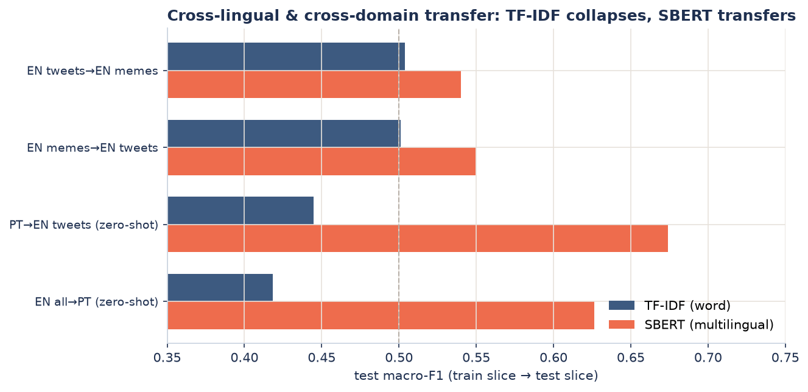
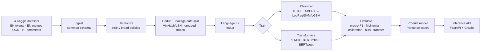

<div align="center">


# Bilingual Hate-Speech Detection (EN / PT)

**Binary hate-speech classification for English and Portuguese social-media text —
a reproducible study comparing classical models with transformers, plus a deployable inference API.**

[](https://github.com/isasaade-23/hate-speech-nlp-en-pt/actions/workflows/ci.yml)
[](https://isasaade-23.github.io/hate-speech-nlp-en-pt/)


</div>

---

## Overview

This project trains and rigorously compares hate-speech classifiers for a **bilingual (EN + PT),
text-only** setting, with language detection at the input. It pursues a dual goal: a
**reproducible research artifact** (every table and figure is generated from code) and a
**deployable product** (a calibrated inference API with a documented model-selection decision).

The scientific core is a fair, leakage-safe comparison of two model families under one protocol:

- **Classical / tabular:** TF-IDF (word + character n-grams) and frozen multilingual
  sentence embeddings (SBERT) feeding Logistic Regression, Linear SVM, and LightGBM.
- **Transformers:** XLM-RoBERTa (bilingual), BERTimbau (PT), and BERTweet (EN), fine-tuned on Colab.

## Key results

- **Transformers win, significantly.** XLM-R reaches macro-F1 **0.750** (strict) and BERTweet
  **0.748** (broad), beating the best classical baseline by ~4 points. The gap is confirmed by a
  paired **McNemar test with Holm correction** (p = 0.003 strict; p < 0.001 broad) — not a lucky split.
- **Cross-lingual transfer is where embeddings earn their keep.** Trained on English and tested
  zero-shot on Portuguese, TF-IDF **collapses** (it shares no vocabulary across languages) while
  multilingual SBERT **transfers** (macro-F1 0.42 → 0.63 EN→PT).
- **Leakage-safe by construction.** Exact + near-duplicate (MinHash/LSH) deduplication and a
  group-stratified, frozen split guarantee no paraphrase crosses train/test — enforced by a CI test.
- **Beyond a single number.** The evaluation adds probability **calibration** (ECE/Brier), an
  identity-term **bias probe**, and a qualitative **error analysis** (implicit hate is the main blind spot).
- **A data-integrity bug, found and fixed.** The Portuguese source was being decoded as latin-1
  when it is UTF-8; a byte-level audit caught it, and the whole pipeline was rebuilt on corrected
  text (this alone lifted zero-shot EN→PT transfer by ~4 points).

<div align="center">


*Test macro-F1 by model and label policy. Transformers (coral) top both policies; the gap over
the best classical baseline is statistically significant.*

</div>

### Final comparison (test macro-F1)

| Policy | Best transformer | Best classical | Δ | Significance (McNemar + Holm) |
|--------|------------------|----------------|----|-------------------------------|
| strict | XLM-R — **0.750** | tfidf_logreg — 0.709 | +0.041 | p = 0.003 |
| broad  | BERTweet — **0.748** | tfidf_lgbm — 0.698 | +0.050 | p < 0.001 |

### Cross-lingual & cross-domain transfer

<div align="center">



</div>

| Experiment (broad) | TF-IDF (word) | SBERT (multilingual) |
|--------------------|:-------------:|:--------------------:|
| EN → PT (zero-shot) | 0.418 | **0.626** |
| PT → EN (zero-shot) | 0.445 | **0.674** |

The label boundary between *offensive* and *hateful* is treated as a first-class variable: every
result is reported under two policies — **strict** (only explicit hate is positive) and **broad**
(offensive folded into hate) — turning label heterogeneity into a sensitivity analysis.

## Pipeline



## Quickstart

```bash
# 1. Environment (Python 3.12)
python -m venv .venv && . .venv/Scripts/activate      # Windows: .venv\Scripts\activate
pip install -r requirements.txt && pip install -e .

# 2. Reproduce the local pipeline (classical track, CPU)
hsc ingest                       # 4 datasets -> common schema
hsc probe-dataset2               # resolve the unlabeled 1/2/3 tweets source
hsc harmonize --policy strict    # (and --policy broad)
hsc split --policy strict        # leakage-safe frozen split
hsc langid  --policy strict      # language detection
hsc train -c configs/classical/tfidf_logreg.yaml --policy strict
hsc report                       # leaderboard + breakdown tables

# 3. Deeper evaluation (Fase 9)
hsc analyze                      # paired McNemar + calibration
hsc transfer                     # cross-lingual / cross-domain
hsc bias                         # identity-term bias probe
hsc errors                       # qualitative error analysis
hsc product                      # product model selection (Pareto)
```

Transformer fine-tuning runs on Google Colab (GPU): open
[`notebooks/colab_neural.ipynb`](notebooks/colab_neural.ipynb) — a self-contained notebook that
uploads the frozen corpus and trains XLM-R / BERTimbau / BERTweet with the same protocol.

### Serve the API

```bash
uvicorn api.main:app --reload
# POST /predict {"text": "..."}  ->  {label, score, language, model_version, latency_ms}
```

## Product model selection

Choosing the served model is a Pareto trade-off, not just the top macro-F1
(see [`methodology/product_decision.md`](methodology/product_decision.md)):

| Profile | Model | Why |
|---------|-------|-----|
| Best quality | XLM-R | Highest macro-F1; needs a GPU for low latency |
| **Lightweight CPU MVP** | **tfidf_logreg** | p95 **1.6 ms**, **3.6 MB**, self-contained, within ~4 pts of XLM-R |
| Calibrated scores | sbert_lgbm | Best ECE, at the cost of a 470 MB encoder |

**License gate:** all current models are trained on the full corpus and are therefore
research-only. A commercially clear model must be retrained on permissively licensed data
(the whitelist currently holds only the Apache-2.0 source). See
[`methodology/data_provenance.md`](methodology/data_provenance.md).

## Repository layout

```
configs/        experiment configs (data, labels, classical, neural) — the methodology, as code
src/hsc/        installable package: ingest, harmonize, clean, splits, langid,
                features (tfidf, embeddings), models, train, evaluate, analysis,
                transfer, bias_probe, error_analysis, product, inference
api/            FastAPI service      demo/   Gradio demo      deploy/  Docker
notebooks/      self-contained Colab notebook for the transformers
methodology/    decision log, data provenance, label mapping, experiment log, limitations
tests/          leakage gate + metric + contract tests (pytest)
assets/         committed figures (regenerate with assets/make_figures.py)
```

## Reproducibility & methodology

Experiments are config-driven and seeded; each run records its config, git SHA, and seed. The
decision trail lives in [`methodology/`](methodology/): a chronological decision log, data
provenance with licenses, the label-mapping rationale, the experiment log, and known limitations.

## Responsible use

This is a probabilistic research classifier, not a moderation oracle. It reflects the biases of its
training data — the bias probe shows measurable over-flagging of some identity terms — and should
support, never replace, human review. Redistribution is bound by the individual dataset licenses.

## License

Code is released under the [MIT License](LICENSE). Training-data licenses vary by source and
restrict commercial use; see `methodology/data_provenance.md`.

## Author

**Isabela Venancio da Silva** — PhD candidate in Public Health (ML applied to health), University of
São Paulo (FSP-USP), LABDAPS.
[ORCID](https://orcid.org/0000-0003-0156-7837) ·
[Lattes](http://lattes.cnpq.br/7006765766090773)
