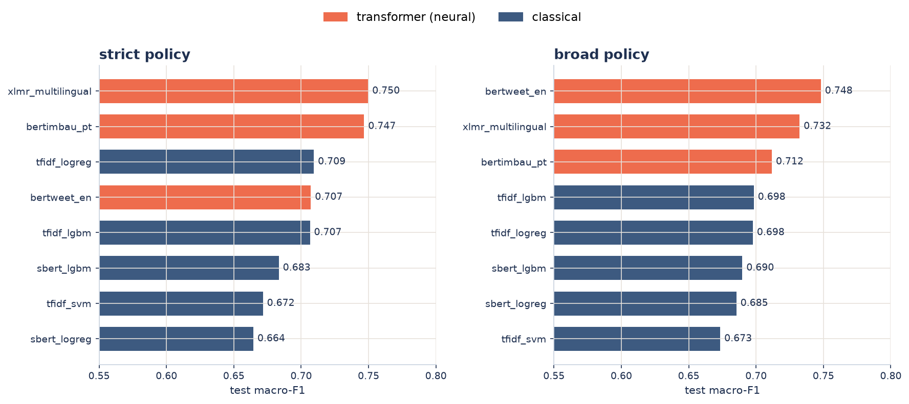

# Results

All numbers are on the frozen test split, seed 42, reported under two label policies:
**strict** (only explicit hate is positive) and **broad** (offensive folded into hate).

## Beta 2.0 (corpus v4, current)

Beta 2.0 follows Gandhi et al. (2024), *Expert Systems*
([doi:10.1111/exsy.13562](https://doi.org/10.1111/exsy.13562)): stacked ensembles and
affective-lexicon features carry documented gains, and text-only models collapse on meme OCR.
Corpus v4 = v3 (six sources) with the meme-OCR source demoted to an external test set after
its per-source ROC-AUC measured 0.547 (random). 53,540 rows strict after deduplication,
frozen split 38,241 / 7,650 / 7,649, leakage gate green.

| Model (strict, test) | ROC-AUC | macro-F1 | Recall on hate | ECE |
|----------------------|---------|----------|----------------|-----|
| **Stacked ensemble (served)** | **0.877** | **0.711** | 0.548 | 0.044 |
| tfidf_logreg | 0.873 | 0.702 | 0.481 | — |
| tfidf_lgbm | 0.860 | 0.707 | 0.497 | — |
| tfidf_svm | 0.855 | 0.695 | 0.521 | — |
| Stack + SBERT members (not served) | 0.886 | 0.715 | 0.511 | 0.043 |

The served stack is a meta logistic regression over the three TF-IDF models; meta weights,
decision threshold and Platt calibration are all fit on validation only, and the test split
is touched once per composition. 15 MB, ~34 ms per text on CPU. The five-member stack adds
0.009 AUC but requires the 470 MB SBERT encoder, which does not fit the deployment budget.

Per-source ROC-AUC of the served stack: HateBR 0.912, ToLD-Br 0.906, EN tweets 0.829,
Fortuna 0.746. Portuguese is now the model's strongest language; the remaining AUC is lost
on the EN tweets source and on Fortuna's subjective label boundary.

Broad policy: served stack macro-F1 0.758, ROC-AUC 0.848 (best classical single:
tfidf_logreg 0.758 / 0.845).

## v1 study (original corpus, archived)

Everything below was measured on the original 4-dataset corpus, before HateBR, ToLD-Br and
the meme-OCR demotion. The transformers have not been re-run on corpus v4 (Colab GPU
pending), so these numbers describe that corpus, not the current one.

### Model comparison

{ width="100%" }

*Test macro-F1 by model and policy. Transformers (coral) top both policies.*

| Policy | Best transformer | Best classical | Δ | McNemar + Holm |
|--------|------------------|----------------|----|----------------|
| strict | XLM-R · **0.750** | tfidf_logreg · 0.709 | +0.041 | p = 0.003 |
| broad  | BERTweet · **0.748** | tfidf_lgbm · 0.698 | +0.050 | p < 0.001 |

The transformer advantage is statistically significant, not an artifact of one split.
BERTimbau (PT) reaches recall-on-hate 0.796 in strict on correctly decoded Portuguese.

### Cross-lingual and cross-domain transfer

{ width="100%" }

| Experiment (broad) | TF-IDF (word) | SBERT (multilingual) |
|--------------------|:-------------:|:--------------------:|
| EN to PT (zero-shot) | 0.418 | **0.626** |
| PT to EN (zero-shot) | 0.445 | **0.674** |
| tweets to memes (cross-domain) | 0.504 | 0.540 |
| memes to tweets (cross-domain) | 0.501 | 0.550 |

TF-IDF word features share no vocabulary across languages, so cross-lingual recall on hate
falls to near zero; multilingual embeddings place EN and PT in one space and transfer.

### Calibration

The served score should be interpretable as a probability. Best-calibrated models are
`sbert_lgbm` (ECE 0.032 strict, 0.056 broad) and the conservative `tfidf_svm`; the
transformers win on macro-F1 but not on calibration. This trade-off carries into the
[product decision](api.md).

### Identity-term bias

An unintended-bias probe measures the false-positive rate on non-hate text that merely
mentions an identity group (neutral terms, bilingual). Over-flagging is real across all
models. Sexual-orientation mentions reach a false-positive rate of 0.75 vs. 0.17
background for TF-IDF. The transformers show the smallest gaps (~0.26).

### Error analysis

For the best model, **implicit hate** (hateful text with no profanity token) is the largest
false-negative bucket. XLM-R reduces it (183 vs. 206 for the best classical), consistent
with a contextual model catching subtler hate; it over-flags slur-bearing non-hate slightly
more. Portuguese is over-flagged relative to English (a higher false-positive rate).

### Why the linear model is competitive

The best classical model (`tfidf_logreg`, 0.709 strict) sits about four points below the best
transformer, which is close for a bag-of-words model. Hate detection in this corpus is largely
lexical. The top-weighted word features of `tfidf_logreg` are explicit slurs and identity-attack
terms in both languages, and 19 of the 50 highest weights are character n-grams that absorb
spelling and obfuscation. Within the classical family, McNemar (Holm) places `tfidf_logreg` above
`tfidf_lgbm` in strict and level in broad, and the linear SVM below both because its scores rank
worse (AUC 0.772 vs. 0.841). A linear model over sparse word and character features is near the
ceiling for this signal. The transformer edge comes from context and cross-lingual transfer, not
from the explicit cases the linear model already gets.

### Stop-word ablation

Removing bilingual stop words (prepositions, pronouns, articles; negations kept) from the TF-IDF
word features and retraining does not move the classical models. macro-F1 shifts by −0.009 to
+0.005 across six model-by-policy runs, inside the confidence interval, and ROC-AUC is essentially
unchanged. Character n-grams and IDF already down-weight function words, so removing them is
redundant. The preprocessing was left unchanged. The
[live demo](https://luciola-hatecheck.streamlit.app/) shows this as an
interactive heatmap.

### Surface plus semantic ensemble

Averaging the classical model (surface, lexical) with the best transformer (semantic) does not
raise macro-F1, which is already at the data ceiling. It raises the number that matters ethically.

| Policy | Best single | Ensemble | Hate recall (single → ensemble) |
|--------|-------------|----------|---------------------------------|
| strict | XLM-R 0.749 | 0.748 | 0.55 → 0.63 |
| broad  | BERTweet 0.750 | 0.754 | 0.61 → 0.65 |

The classical model catches explicit hate by threshold, the transformer catches implicit hate, and
the combination recovers part of the implicit false negatives, with higher AUC on both policies.

### Tabular foundation model (TabPFN)

TabPFN was run over dense features, on the full training sample on GPU, against LightGBM and LogReg
on the same features. The dense features are multilingual SBERT and TF-IDF reduced to 300 dimensions
by SVD.

| Features | TabPFN (strict / broad) | LightGBM | LogReg |
|----------|-------------------------|----------|--------|
| SBERT          | **0.684 / 0.699** | 0.675 / 0.681 | 0.638 / 0.685 |
| TF-IDF → SVD(300) | **0.676 / 0.691** | 0.671 / 0.664 | 0.670 / 0.686 |

TabPFN is the strongest classifier on dense features, beating LightGBM and LogReg on both feature
sets and both policies. It ties the best classical model (McNemar not significant, p = 0.22 strict
and p = 0.70 broad) and stays below the sparse TF-IDF baseline and the transformers. Dense
compression drops the rare surface tokens that carry the signal, so the bottleneck is the
representation, not the classifier.

!!! note "Multi-seed confidence intervals"
    Results shown are single-seed (42). Re-running the transformers over seeds 42/43/44
    and calling `hsc report` produces `leaderboard_agg.csv` with mean ± std per model.
